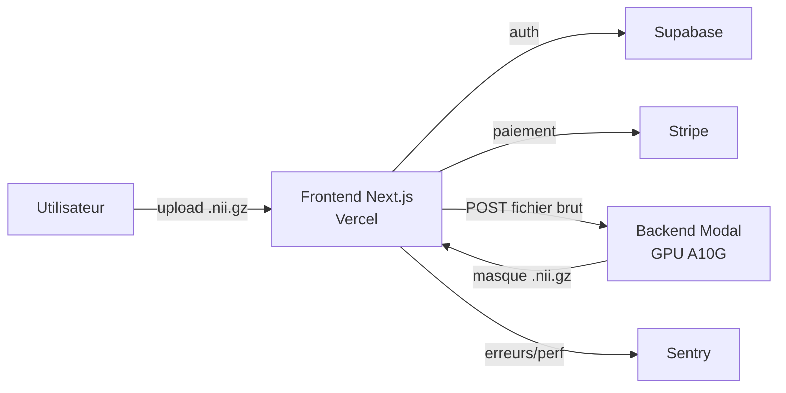

# CardioSeg — Segmentation cardiaque automatisée

Application de segmentation automatique de structures cardiaques et des artères coronaires à partir d'images CT au format NIfTI (`.nii` / `.nii.gz`), combinant un pipeline de deep learning cascadé (U-Net 3D + Swin UNETR V2) et une interface web complète (auth, paiement par crédits, visualisation 2D/3D).

## Sommaire

- [Architecture](#architecture)
- [Structures segmentées](#structures-segmentées)
- [Prérequis](#prérequis)
- [Installation](#installation)
  - [1. Backend / ML (Modal)](#1-backend--ml-modal)
  - [2. Frontend (Next.js)](#2-frontend-nextjs)
- [Lancer le projet](#lancer-le-projet)
  - [Backend en local (dev, hot-reload)](#backend-en-local-dev-hot-reload)
  - [Backend en production](#backend-en-production)
  - [Frontend en local](#frontend-en-local)
  - [Frontend en production](#frontend-en-production)
- [Variables d'environnement](#variables-denvironnement)
- [Structure du projet](#structure-du-projet)
- [Pipeline d'inférence](#pipeline-dinférence)
- [Modèles pré-entraînés](#modèles-pré-entraînés)
- [Dépannage](#dépannage)

---

## Architecture

Le projet est découplé en deux services indépendants :

- **Backend d'inférence** : service Python déployé sur [Modal](https://modal.com) (GPU serverless A10G), exposant deux endpoints HTTP (`/segment_nifti`, `/health`).
- **Frontend** : application Next.js 16 déployée sur [Vercel](https://vercel.com), avec authentification Supabase, paiement Stripe (système de crédits) et monitoring Sentry.



## Structures segmentées

Le masque de sortie contient 10 labels :

| Label | Structure | Modèle |
|-------|-----------|--------|
| 0 | Fond | — |
| 1 | Myocarde VG | U-Net 3D |
| 2 | Oreillette gauche | U-Net 3D |
| 3 | Ventricule gauche | U-Net 3D |
| 4 | Ventricule droit | U-Net 3D |
| 5 | Oreillette droite | U-Net 3D |
| 6 | Aorte ascendante | U-Net 3D |
| 7 | Artère pulmonaire | U-Net 3D |
| 8 | Coronaire gauche | Swin UNETR V2 |
| 9 | Coronaire droite | Swin UNETR V2 |

## Prérequis

- **Conda** (Anaconda ou Miniconda) — pour l'environnement Python du backend/ML
- **Node.js ≥ 20** et **npm** — pour le frontend
- Un compte [Modal](https://modal.com) (CLI + token d'API)
- Un compte [Supabase](https://supabase.com) (URL + clés API)
- Un compte [Stripe](https://stripe.com) (clés test ou live)
- Un compte [Sentry](https://sentry.io) (DSN) — optionnel mais recommandé

## Installation

### 1. Backend / ML (Modal)

Créer l'environnement conda à partir du fichier fourni :

```bash
cd segmentation
conda env create -f environment.yml
conda activate cardioseg
```

Se connecter à Modal (ouvre une page web pour l'authentification) :

```bash
modal setup
# ou : modal token new
```

Placer les checkpoints des modèles dans `ml/pretrained_models/` (voir [Modèles pré-entraînés](#modèles-pré-entraînés)) :

```
ml/pretrained_models/
├── 1stage.ckpt      # détection du cœur (crop)
├── 2stage.ckpt      # segmentation cardiaque (7 structures)
└── coronary.ckpt    # segmentation des coronaires (Swin UNETR)
```

### 2. Frontend (Next.js)

```bash
cd segmentation/frontend
npm install
cp .env.local.example .env.local   # si le fichier exemple existe, sinon créer manuellement
```

Renseigner les variables dans `.env.local` (voir [Variables d'environnement](#variables-denvironnement)).

## Lancer le projet

### Backend en local (dev, hot-reload)

```bash
conda activate cardioseg
cd segmentation/api
modal serve modal_inference.py
```

Modal affiche une URL temporaire (`*.modal.run`) à utiliser pendant le développement. Le code est rechargé automatiquement à chaque modification.

### Backend en production

```bash
conda activate cardioseg
cd segmentation/api
modal deploy modal_inference.py
```

Cette commande construit l'image Docker (si nécessaire) et déploie les deux endpoints de façon persistante :
- `https://<user>--cardioseg-inference-segment-nifti.modal.run`
- `https://<user>--cardioseg-inference-health.modal.run`

Vérifier le déploiement :

```bash
curl https://<user>--cardioseg-inference-health.modal.run
```

### Frontend en local

```bash
cd segmentation/frontend
npm run dev
```

L'application est disponible sur `http://localhost:3000`.

### Frontend en production

Le déploiement se fait via la CLI Vercel :

```bash
cd segmentation/frontend
vercel --prod
```

Ou automatiquement à chaque push si le dépôt Git est lié à un projet Vercel.

## Variables d'environnement

Fichier `segmentation/frontend/.env.local` :

```bash
# Supabase
NEXT_PUBLIC_SUPABASE_URL=https://xxxxx.supabase.co
NEXT_PUBLIC_SUPABASE_ANON_KEY=xxxxx
SUPABASE_SERVICE_ROLE_KEY=xxxxx

# Stripe
NEXT_PUBLIC_STRIPE_PUBLISHABLE_KEY=pk_test_xxxxx
STRIPE_SECRET_KEY=sk_test_xxxxx
STRIPE_WEBHOOK_SECRET=whsec_xxxxx

# Sentry
NEXT_PUBLIC_SENTRY_DSN=https://xxxxx.ingest.de.sentry.io/xxxxx
SENTRY_ORG=xxxxx
SENTRY_PROJECT=cardioseg
SENTRY_AUTH_TOKEN=xxxxx

# API Modal (optionnel — a des valeurs par défaut dans lib/config.ts)
NEXT_PUBLIC_API_URL=https://<user>--cardioseg-inference-segment-nifti.modal.run
NEXT_PUBLIC_HEALTH_URL=https://<user>--cardioseg-inference-health.modal.run
```

Ces mêmes variables doivent être configurées sur Vercel pour la production :

```bash
vercel env add NEXT_PUBLIC_SUPABASE_URL production
vercel env add SUPABASE_SERVICE_ROLE_KEY production
# ... etc pour chaque variable
```

Tables Supabase requises (`user_credits`, `payment_logs`) : voir le SQL fourni dans le dépôt ou l'historique du projet.

## Structure du projet

```
segmentation/
├── environment.yml           # environnement conda (backend/ML)
├── api/
│   ├── modal_inference.py    # app Modal : pipeline d'inférence 3 étapes
│   └── requirements.txt      # dépendances Python (pour référence/Docker)
├── ml/
│   ├── segmenter.py          # U-Net 3D — 8 classes (structures cardiaques)
│   ├── segmenter_2labels.py  # U-Net 3D — 2 classes (détection du cœur)
│   ├── model_adaptable.py    # architecture UNet3D_adaptable (depth, start_filts)
│   ├── models/
│   │   ├── swin_unetr.py     # Swin UNETR V2 — 3 classes (coronaires)
│   │   └── losses.py         # DiceLoss, ClDiceLoss
│   ├── utils.py               # prétraitement / post-traitement U-Net
│   ├── preprocessing_swin.py  # prétraitement / post-traitement coronaires
│   ├── sitk_utils.py          # utilitaires SimpleITK (resize, resample)
│   ├── dataset.py             # chargement des données, K-Fold cross-val
│   └── pretrained_models/     # checkpoints (.ckpt) — non versionnés (gros fichiers)
└── frontend/
    ├── src/
    │   ├── app/
    │   │   ├── auth/          # page de connexion (email + Google OAuth)
    │   │   ├── upload/        # upload + suivi de progression
    │   │   ├── result/        # visualisation des résultats (Niivue)
    │   │   ├── pricing/       # achat de crédits (Stripe)
    │   │   └── api/           # routes API Next.js (checkout, credits, webhook)
    │   ├── components/        # NiivueViewer, Navbar, AuthProvider, animations
    │   └── lib/                # config, clients Supabase/Stripe, gestion des crédits
    ├── sentry.*.config.ts      # configuration Sentry (client/serveur/edge)
    └── next.config.ts
```

## Pipeline d'inférence

1. **Détection du cœur (crop)** — `Segmenter_2labels` (U-Net 3D, 2 classes) localise le cœur sur l'image complète redimensionnée en 128³, puis calcule une boîte englobante (+15 % de marge).
2. **Segmentation cardiaque** — `Segmenter` (U-Net 3D, 8 classes) segmente les 7 structures cardiaques sur l'image recadrée.
3. **Segmentation des coronaires** — `SwinUNETRSegmenter` (Swin UNETR V2, 3 classes) segmente les artères coronaires gauche/droite sur la même région recadrée, avec un prétraitement HU dédié ([-200, 1411] HU, normalisation min-max).
4. **Fusion** — les labels coronaires (8, 9) sont superposés au masque cardiaque (les coronaires priment sur les structures sous-jacentes).

En cas d'échec d'une étape (coronaires notamment), le pipeline se dégrade proprement et renvoie le masque cardiaque seul (voir en-tête de réponse `X-Coronary-Status`).

## Modèles pré-entraînés

Les checkpoints (`.ckpt`) ne sont **pas versionnés** dans Git (fichiers volumineux, voir `.gitignore`). Ils doivent être placés manuellement dans `ml/pretrained_models/` avant le déploiement :

| Fichier | Modèle | Taille approx. |
|---------|--------|-----------------|
| `1stage.ckpt` | Segmenter_2labels (crop) | ~67 Mo |
| `2stage.ckpt` | Segmenter (8 classes) | ~1,1 Go |
| `coronary.ckpt` | SwinUNETRSegmenter (coronaires) | ~613 Mo |

## Dépannage

- **`command not found: modal`** → activer l'environnement conda (`conda activate cardioseg`) avant toute commande Modal.
- **Le frontend affiche "erreur réseau"** → vérifier que le backend Modal est bien déployé (`curl .../health`) et que l'URL dans `lib/config.ts` / `.env.local` est à jour.
- **Checkpoint corrompu** (`PytorchStreamReader failed reading zip archive`) → le fichier `.ckpt` a été mal transféré ; le re-télécharger/copier depuis la source d'origine.
- **Projet Supabase en pause** → sur le plan gratuit, un projet inactif 7 jours est mis en pause ; le réactiver depuis le dashboard Supabase (`Restore project`).
